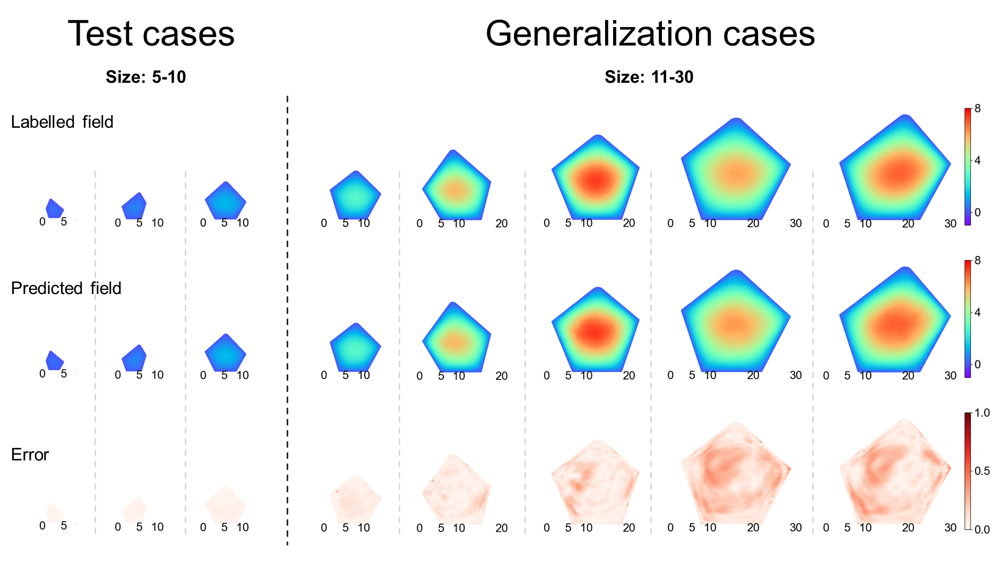
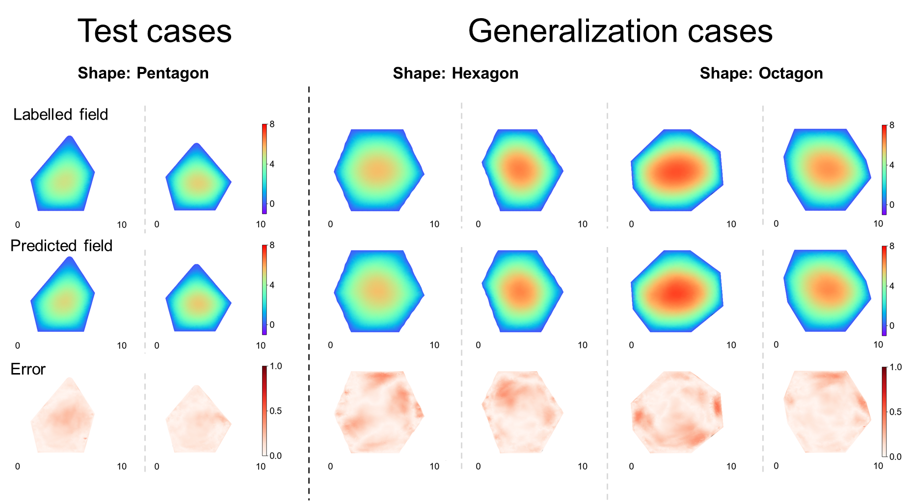
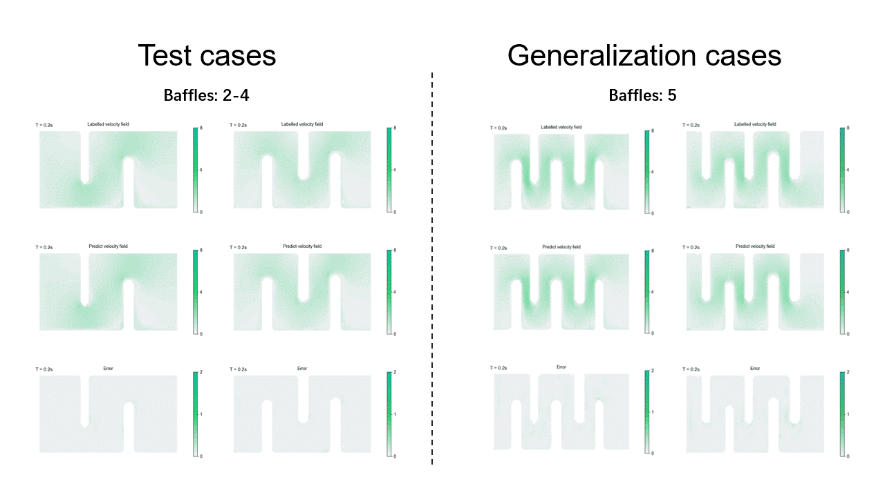

# Diffeomorphism-Neural-Operator
Diffeomorphism-Neural-Operator is a neural operator framework for solving PDEs with various domain and also parameters. It can learn an opertor on generic domain wich is a series domains witch is  diffeomorphically mapped from various physics domains expressed by the same PDE.
Diffeomorphism-Neural-Operator is strong generalization ability to size and shape of domains, and resolution invariant

## Data download
Darcy flow datasets: https://drive.google.com/drive/folders/1z8s25cKcF6nprngf8lcTXp5F1ECp7h6W?usp=drive_link

Pipe flow datasets: https://drive.google.com/drive/folders/1vtgPTYd83bQq-shw4fQizHURF7uJxcMF?usp=drive_link

Airfoil flow datasets: https://drive.google.com/drive/folders/1pmYZ1B_c1zVkOmeoksf6kTSKOGMSf2l1?usp=drive_link

## Data Generate

If you want to try generating data yourself, we provide programs for generating data, including diffeomorphism methods and PDE solving processes. Using a pentagon with Darcy flow as an example, we demonstrate how to generate data, which mainly involves the following steps:

1. Generate the geometric domain and mesh it. Here, we use the **obj** format for the geometric domain, which can be generated using any meshing tool. Some examples are provided in the **part_obj** folder for testing purposes. The various domains of pentagon is genereted by a **MATLAB** process **part_generate.m**

2. Map the physical geometric domain diffeomorphically to a generic domain. Use **create_map.py** to map the mesh of the obj to a **unit rectangle domain**, and sample regularly in the rectangular domain with the solution of 128. Store the geometric coordinates of the sampling points corresponding to the physical domain in the **data** folder, namely **x_data.csv** and **y_data.csv**.

3. Generate physical field data. Based on the geometric domain and parameters, generate input and output fields and sample the input and output fields at the acquired sampling points. This yields the parameter field **C** and the output field **U**, which are stored in the data folder. The PDE solved by MATLAB process **data_generate.m**

Note: The points in **x_data.csv** and **y_data.csv** correspond one-to-one with the values in **C.csv** and **U.csv**.

If you want to get the code of Pipe flow (Generated by **Phiflow**) and Airfoils flow (Generated by **OpenFoam**), please email us. 

## Train

Here are the training and testing programs for Darcy flow. Once the dataset is prepared, you can run train.py using the following command: 
 ```bash
    python train.py
 ```

## Test

After training, the model will be stored in the `model` directory. You can use the provided testing program `test.py` to evaluate the trained model.
 
 ```bash
    python test.py
 ```

You can test the model with datasets of different resolutions, sizes, and shapes. 
The results will be stored in files named `result_train_dataset`, where `'train_dataset'` denotes the name of the training dataset.

## Experiment
Experiments on two statics scenarios (Darcy flow and mechanics) and two dynamic scenarios (pipe flow and airfoil flow) were carried out
### Darcy flow

#### Generalization on  domains with different size


#### Generalization on  domains with different shape


### Pipe flow


### Airfoil flow


